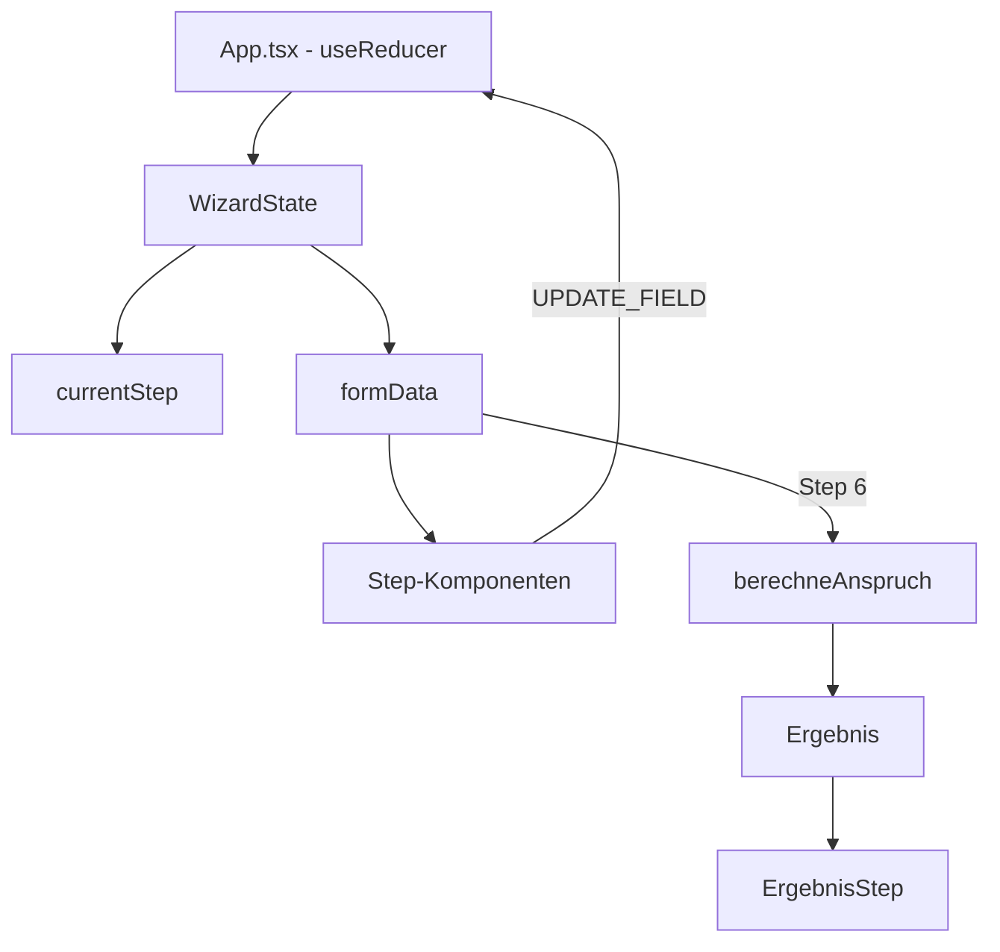

# Architektur: Grundsicherungsrechner

## Überblick

Single-Page React-App als 5-Schritte-Wizard zur Prüfung des Anspruchs auf Grundsicherung im Alter (SGB XII). Alle Berechnungen client-seitig, keine Server-Kommunikation.

## Tech Stack

- **React 19** + TypeScript (Vite)
- **Tailwind CSS v4** (Vite-Plugin)
- **Lucide React** für Icons
- **Google Fonts** (Nunito + Merriweather) via CDN

## Datenfluss



## Dateistruktur

```
src/
├── types.ts              # Alle TypeScript-Typen
├── constants.ts          # Regelsätze, Altersgrenzen, Freibeträge
├── calculations.ts       # Reine Berechnungslogik (testbar)
├── calculations.test.ts  # 16 Unit-Tests
├── App.tsx               # Wizard-Controller (useReducer)
└── components/
    ├── Header.tsx            # Stepper-Navigation
    ├── Footer.tsx            # Disclaimer + Datenschutz
    ├── NavigationButtons.tsx # Zurück/Weiter
    ├── ui/                   # Wiederverwendbare UI-Komponenten
    │   ├── Tooltip.tsx
    │   ├── RadioGroup.tsx
    │   ├── NumberInput.tsx
    │   ├── InfoBox.tsx
    │   └── DatePicker.tsx
    └── steps/                # Wizard-Schritte
        ├── IntroPage.tsx
        ├── PersonalStep.tsx
        ├── WohnungStep.tsx
        ├── EinkommenStep.tsx
        ├── VermoegenStep.tsx
        ├── ZusatzfragenStep.tsx
        └── ErgebnisStep.tsx
```

## State Management

`useReducer` in App.tsx mit einem flachen `FormData`-Objekt. Alle Felder aller Steps werden zentral verwaltet. Kein Context nötig, da alle Steps direkte Kinder von App sind.

## Berechnungslogik

Die Datei `calculations.ts` enthält reine Funktionen ohne UI-Abhängigkeiten:

1. `getAltersgrenze(geburtsjahr)` – Regelaltersgrenze nachschlagen
2. `hatAltersgrenzeErreicht(geburtsjahr, monat)` – Stichtag prüfen
3. `pruefeVermoegen(vermoegen, hatPartner)` – Schonvermögen prüfen
4. `berechneBedarf(input)` – Regelsatz + Wohnkosten + Mehrbedarf
5. `berechneAnrechenbaresEinkommen(input)` – Einkommen minus Freibeträge
6. `berechneAnspruch(allInputs)` – Hauptfunktion, orchestriert alle Prüfungen
